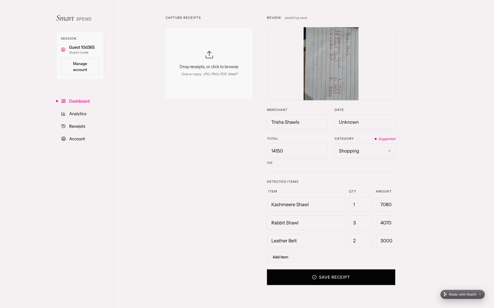
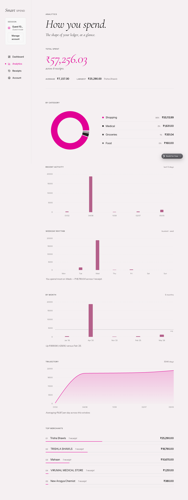
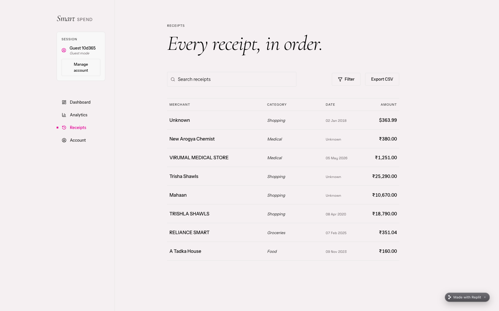
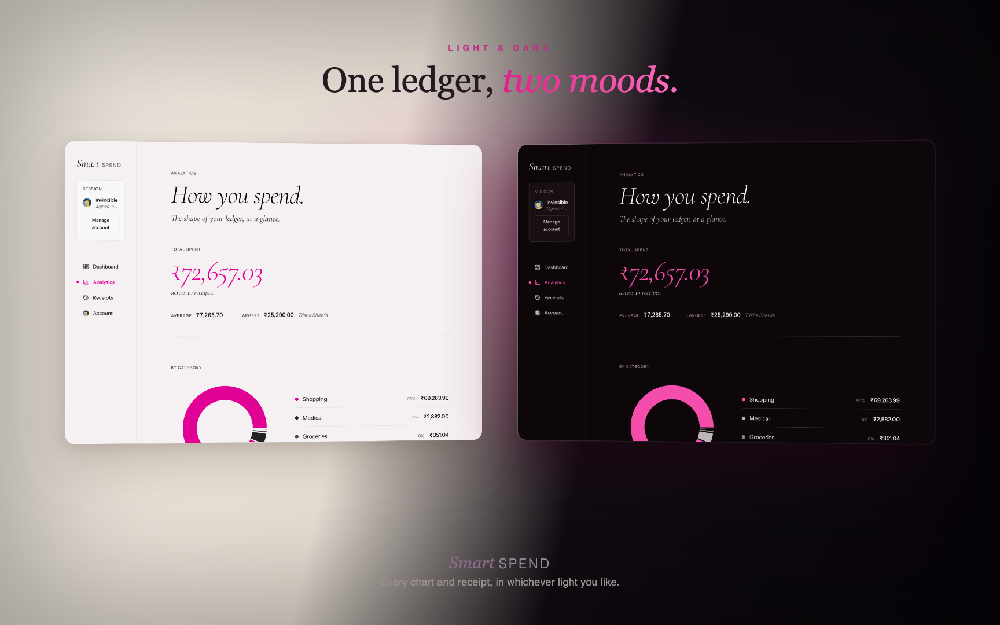

# SmartSpend

[](https://github.com/kanishk-upadhyay/smartspend/actions/workflows/ci.yml)
[](LICENSE)
[](https://smartspend--invincible01.replit.app/)

Every expense app I tried still made *me* do the data entry — so I built one where the
model does it.

Snap a receipt — even a crumpled, handwritten, sideways one — and it comes back as clean
structured data: vendor, total, date, line items, and currency. SmartSpend sorts it into a
category and charts where your money actually goes. No typing.

Extraction runs on a vision model (Google Gemini), with a second (Z.AI GLM-4.6V) as an
automatic fallback — so scanning keeps working even when the primary model is rate-limited
or down.

**[▶ Try the live demo](https://smartspend--invincible01.replit.app/)** — no signup, guest mode is instant.



<p align="center"><em>Reading a rotated, handwritten shop bill straight into merchant, total, category, and line items.</em></p>

## Features

- **Reads any receipt** — printed, handwritten, even rotated or skewed — into vendor,
  total, date, per-line-item breakdown, and a suggested category, from an image or PDF.
- **Falls back on its own** — Gemini first, Z.AI second if it fails, and a validation
  step flags receipts whose line items don't sum to the stated total.
- **Speaks any currency** — converts each receipt to your base currency at capture
  (the original stays viewable per receipt), and reconverts the rest on demand when you
  change it.
- **Takes a whole stack** — drop several receipts at once and confirm them one at a time.
- **Charts where it went** — spend by category, daily trend, top merchants, and largest
  receipts.
- **Hands you the controls** — edit, delete with undo, search, filter, and export to CSV.
- **Starts without a signup** — use it instantly in guest mode, or sign in with email
  (with password reset); per-user data isolation throughout.

## Screenshots

**Analytics** — spend by category, activity and monthly trends, a cumulative
trajectory, and top merchants.



<p align="center"><em>The bad news, visualized.</em></p>

**Receipts** — every capture in one searchable, CSV-exportable ledger, across
currencies.



## Light & dark

A full light and dark theme (with a system-follow "Auto" option) — every
view, chart, and receipt recomposed for either.



## Tech stack

- **Backend** — FastAPI, SQLAlchemy, PostgreSQL, Google Gemini and Z.AI SDKs
- **Frontend** — React 19, TypeScript, Vite, Recharts, Framer Motion, Tailwind CSS
- **Services** — Supabase for Postgres, authentication, and file storage

## Architecture

The backend is a FastAPI service handling OCR, expense CRUD, and analytics. Receipt
images are stored in Supabase Storage and served via signed URLs; expense metadata
lives in Postgres. Requests are authenticated with Supabase-issued JWTs. The frontend
is a single-page React app built with Vite and served by the backend.

```
frontend/                 React + Vite single-page app
backend/
  main.py                 API routes: upload, expenses, account, analytics
  ocr_utils.py            OCR orchestration (Gemini, then Z.AI fallback)
  gemini_extractor.py     primary extractor
  zai_extractor.py        fallback extractor
  database.py             SQLAlchemy models and schema setup
```

## Running locally

**Backend**

```bash
cd backend
python -m venv venv && source venv/bin/activate
pip install -r requirements.txt

export GEMINI_API_KEY=your-key        # ZAI_API_KEY is optional (fallback OCR)
export DATABASE_URL=postgresql+psycopg://...   # omit to use a local SQLite file
export SUPABASE_URL=... SUPABASE_KEY=...        # for image storage + auth

uvicorn main:app --reload
```

**Frontend**

```bash
cd frontend
npm install
cat > .env.local <<EOF
VITE_SUPABASE_URL=...
VITE_SUPABASE_ANON_KEY=...
EOF
npm run dev
```

With no `DATABASE_URL` set, the backend falls back to a local SQLite file, so you can
run it without provisioning a database. See
[`backend/.env.example`](backend/.env.example) for the full set of variables (OCR
models, storage bucket, allowed origins, upload size/rate limits) — the optional ones
all have sensible defaults.

## Engineering notes

A few decisions I made while building this, and why:

- **Dual-OCR with automatic fallback.** A single vision model fails silently under
  rate limits. Routing Gemini → Z.AI on error keeps extraction working, and a
  line-items-vs-total check (flagging >10% mismatch) catches wrong reads instead of
  trusting the model blindly.
- **Provider-agnostic database URL.** The app normalizes any `postgres://` /
  `postgresql://` URL to the `postgresql+psycopg://` (psycopg 3) driver and falls
  back to SQLite when unset — so the same code runs on Supabase in production and on
  a laptop with zero setup.
- **Session pooler over transaction pooler.** Supabase's transaction pooler breaks
  SQLAlchemy's prepared statements; the app connects through the session pooler
  (port 5432) with `pool_pre_ping` + `pool_recycle` to survive dropped idle SSL
  connections.
- **Identity & data isolation.** Signed-in users are scoped by their Supabase JWT;
  guest sessions get a namespaced id that can't address another account's data. Every
  query is owner-scoped, receipt images are served via short-lived signed URLs (not
  public links), and the public OCR upload endpoint is size-capped and rate-limited.
- **Tested and CI-gated.** The backend ships with a pytest suite and the frontend is
  linted and type-checked; both run on every push (see the CI badge above).

## License

MIT — see [LICENSE](LICENSE).

<div align="center"><pre>...CLOSE THE LEDGER, OPEN THE NEXT...</pre></div>
